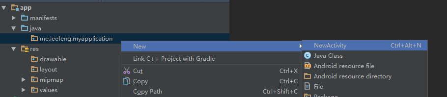
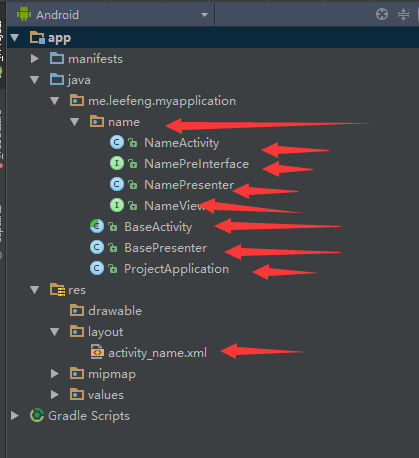
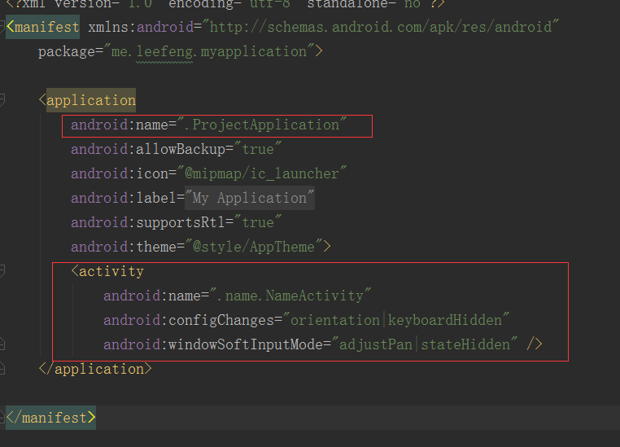

# MVPHelper
一键创建 Activity Presenter View 以及BaseActivity BasePresenter ProjectApplication

###HOW
1、下载jar插件：<a href="https://raw.githubusercontent.com/limxing/MVPHelper/master/MVPHelper/MVPHelper.jar">点击下载</a>

2、打开Androidstudio--> File --> Settings --> Plugins --> Install plugin from disk --> 选择下载的jar
--> 重启Androidstudio

3、右键包名 --> New --> NewActivity（快捷键 Ctrl+Alt+N ） --> 填写Activity前缀 --> 确定 --> 刷新列表

注意：

1、程序先判断BaseActivity是否存在，不存在则生成BaseActivity BasePresenter ProjectApplication 在包名根目录下，并自动在
Manifest文件中添加

2、nameActivity会生成在所点的包下，包括：Activity Presenter View PreInterface ,资源文件也会生成在layout中。
并在Manifest中添加Activity

3、想改变这些固定的格式，那么就去下载Intellij Idea 和本程序源码学习去吧！